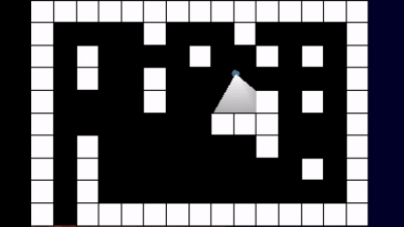

# SFML Raycaster

Pretty much my first C++ "project" - excuse the messy code 😬. Uses SFML's graphics library for creating a window and rendering, just uses standard library headers for everything else. Basic little raycaster with textures and a minimap showing the rays being... ...casted.

## Overview

Works like any old raycasting graphics program does: The "game" is built from a 2D grid-based map, stored as a matrix with 0s representing empyty space and 1s (or other numbers) representing walls. The player has a position and a view angle, from which rays are "casted," checking for collisions at each grid line. To render a "3D" scene, the screen is split into vertical lines, and one ray is cast for each of these lines. Based on the distance from the ray's origin to whichever wall it hits, we can determine how tall the wall should appear on-screen.

|       2D Map        |     Raycasted Walls      |
| :-----------------: | :----------------------: |
|  |  |

Since the collisions only occur on grid lines, it's very easy to determine where the ray collision occurs within the particular grid square (Or where the ray hits a particular wall segment). Since we know which point the rays hit along the particular wall segment, we can easily refer to a texture map to render the correct texture on each vertical line.

Since we already know the distances at which collisions occur, we can also apply a colour based on the distance for a fog or darkness effect on further walls.

## Collisions

Only other feature of note is the collision system with the player. Player runs into walls and slides when moving into walls at an angle. This was a while back but it looks like I implemented a simple AABB type system.

\*\*Seems to have a bug if you run into corners at the wrong angle - code wants to let you slide along wall not realizing it's sliding you into another wall. I'm just updating readmes on old projects right now, maybe I'll fix later lol
